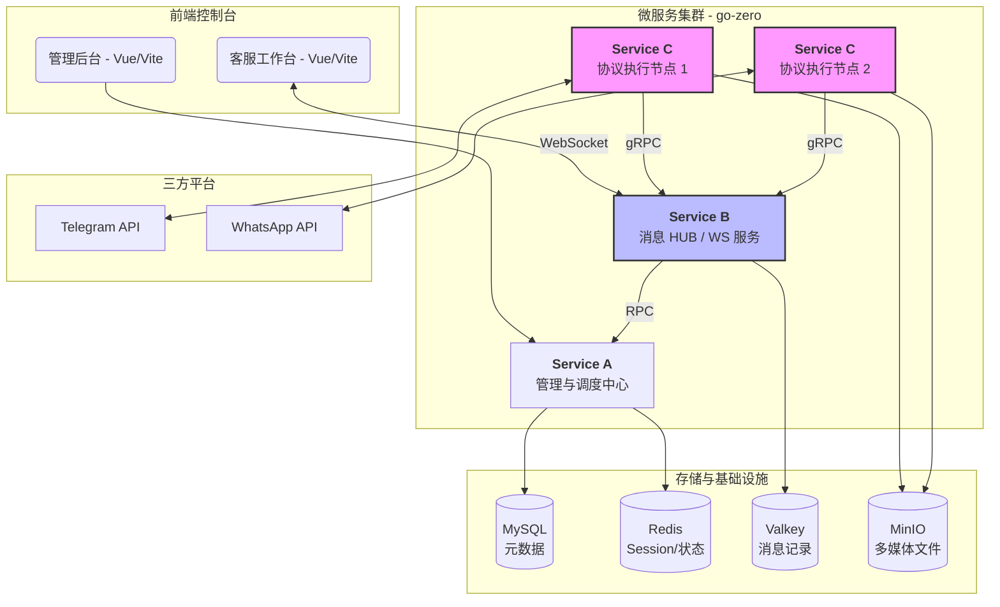

# Telegram Cloud AI：分布式企业级云控即时通讯矩阵

**Telegram Cloud AI** 是一款专为**海量账号管理**与**自动化营销**设计的即时通讯（IM）云控系统。基于 Golang 微服务架构，深度适配 Telegram、WhatsApp 等平台协议。

通过创新的 **B/C 服务分离架构**，系统解决了高并发下的 I/O 瓶颈，支持账号平滑扩容与无状态部署，是构建高性能营销机器人或聚合客服平台的理想选择。

---

## 核心功能概述

### 🧑‍💼 多企业（多租户）管理
- 支持 **多企业独立管理**，企业数据逻辑隔离
- 企业级账号池、IP 池、资源池独立管理
- 支持企业级权限控制与操作审计
- 支持代理商统一管理多个企业

### 🔐 账号与角色体系
- 多账号统一管理，支持账号批量导入、分配、转移与回收
- 账号状态集中控制（上线 / 下线 / 风控 / 双向检测与申诉）
- 批量账号状态检测
- 双向异常识别与一键申诉
- 批量修改账号资料（昵称 / 头像）
- 批量好友备注与数据管理
- 多账号统一调度与执行策略

### 🤖 自动化与营销能力
- 自动打招呼、加好友、加群、拉群
- 批量群发（文本 / 图片 / 链接 / 语音）
- 群聊 / 私聊 **自动话术 & 剧本式聊天**
- 支持机器人广告与营销脚本

### 👥 群组与频道管理
- 批量创建公开 / 私密群与频道
- 群成员管理（好友 / 陌生人）
- 群资料、权限、头像、简介统一配置

### 💬 客服与聊天系统
- 云端可视化聊天客户端
- 多账号并行私聊 / 群聊
- 客服坐席独立分配，支持一人多号
- 支持快捷话术模板与自动翻译
- 客户分组与多账号协同会话

---

## 🏗️ 系统架构设计

本系统采用计算与存储分离、指令与执行解耦的设计理念，分为三个核心微服务：

### 1. 管理后台服务 (Service A)
* **核心职责**：业务调度中心。负责代理商/管理员鉴权、多级账号管理、代理池分配及全局营销策略下发。
  

### 2. 聊天中心服务 (Service B)
* **核心职责**：状态中转与持久化。维护客服端 WebSocket 长连接，负责基于 Valkey 的消息历史存储与状态机维护，将前端指令转换为内部 RPC 调用转发给 Service C。
  
### 3. 云控账号服务 (Service C)
* **核心职责**：协议执行层。作为**无状态服务**运行，负责与协议端（TG/WA）保持连接、消息收发重试、多媒体资源上传至 MinIO。支持根据账号规模进行线性弹性扩容。

---

## 🔥 技术亮点

* **高性能微服务**：底层采用 `go-zero` 框架，集成完善的服务治理、限流、熔断及链路追踪。
* **存储冗余设计**：
    * **MySQL**: 存储核心元数据及配置信息。
    * **Valkey**: 作为独立的消息存储，承载聊天流水记录，并由程序按保留策略清理过期消息。
    * **Redis**: 管理账号 Session 状态及高速缓存，确保系统响应速度。
    * **MinIO**: 分布式存储图片、语音等媒体资源，不占用应用服务器磁盘。
* **极致扩展性**：账号服务（Service C）可独立部署于全球不同区域的服务器，通过分布式代理规避风控，实现真正的“云控”。
* **AI 营销集成**：预留营销任务引擎接口，支持批量脚本、自动回访及基于 AI 的智能客服转换。

---

## 🛠️ 技术栈清单

- **后端**: Golang (go-zero), gRPC
- **前端**: Vue 3, Vite, Element Plus
- **存储**: MySQL, Valkey, Redis, MinIO
- **部署**: Docker, Docker-compose

---

## 📅 项目路线图 (Roadmap)

- [x] Phase 1: 分布式微服务骨架搭建，实现 B/C 服务解耦。

- [x] Phase 2: Telegram 协议深度适配，支持海量账号云端管理。

- [x] Phase 3: 营销任务引擎，支持批量群发与入群自动化。

- [x] Phase 4: 对接 Dify 实现 AI 智能话术生成与自动回复。

- [ ] Phase 5: WhatsApp 协议完整对接（架构设计已完成）。

- [ ] Phase 6: 多维度营销转化漏斗分析报表。

## 📬 联系与支持 (Contact & Support)

如果您有任何疑问、建议、技术支持、商务合作意向，欢迎通过以下方式联系我：

> **提示**：也可以通过 [GitHub Issues](https://github.com/lucasqqwwee/telegram-cloud-ai/issues) 提交反馈。
