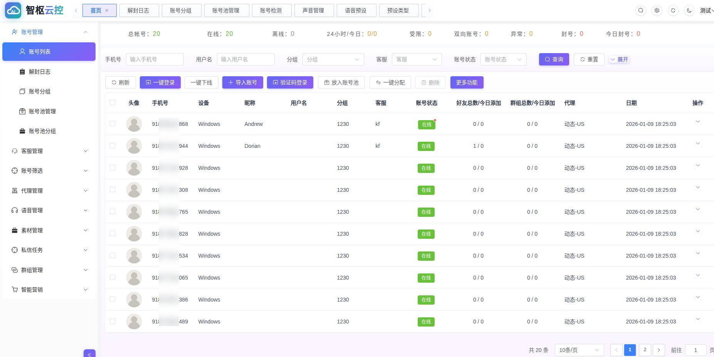
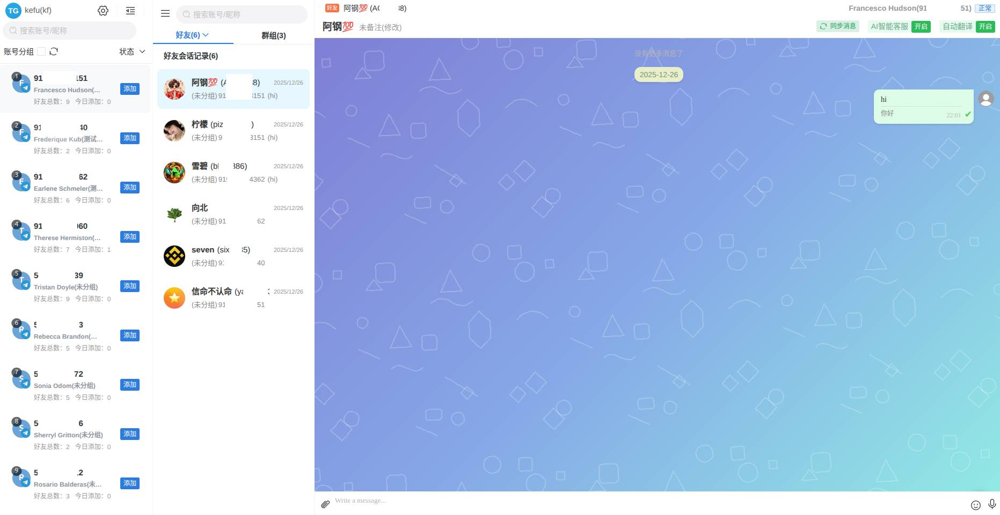
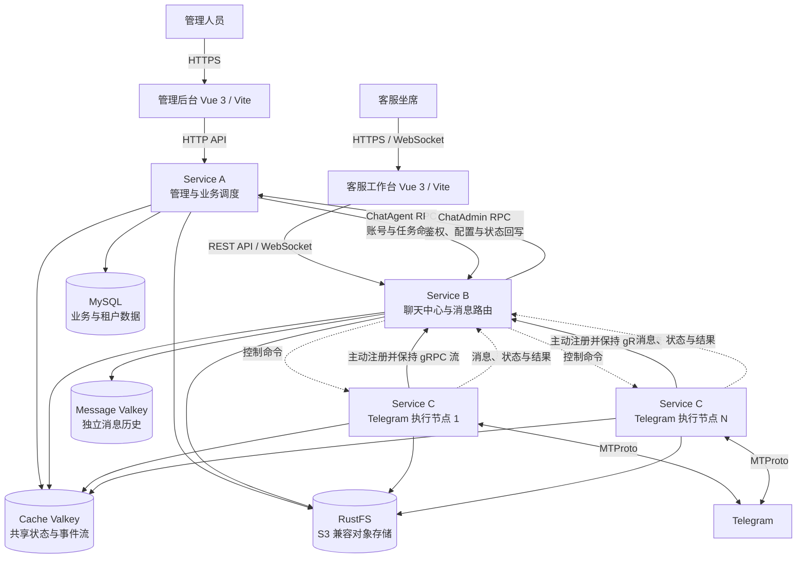

# Telegram Cloud AI

## 企业级 Telegram 多账号运营、智能营销与聚合客服平台

**Telegram Cloud AI** 面向需要统一管理大量 Telegram 账号的企业团队，将账号运营、客服协作、自动化任务、AI 话术与平台协议执行整合为一套可私有化部署的系统。

系统采用管理服务、聊天中心和 Telegram 执行节点三层解耦架构。管理与客服前端不直接接触 Telegram 协议；平台节点主动连接聊天中心，通过 gRPC 双向长连接接收命令并回传消息、状态与执行结果。业务规模增长时，可按账号负载横向增加执行节点，而无需改造管理与客服系统。

---

## 客户价值

| 业务目标 | 平台能力 |
| --- | --- |
| 统一管理分散账号 | 账号池、分组、分配、状态检测、批量操作与代理规则集中管理 |
| 提升客服承载能力 | 一个工作台处理多账号私聊和群聊，实时同步消息、联系人与账号状态 |
| 让运营流程可复制 | 话术库、营销方案、批量任务、执行明细和状态追踪形成标准化流程 |
| 引入 AI 提效 | 支持 AI 回复、智能营销话术、翻译及可选的语音合成能力 |
| 掌控数据与部署 | 支持企业私有化部署，业务数据、消息记录和媒体资源均由客户环境承载 |
| 平滑扩展账号规模 | Telegram 执行节点独立部署，可根据区域、代理资源和账号负载水平扩容 |

### 适用场景

- 跨境业务的多语言客服与客户关系维护
- 多企业、多团队或代理商模式下的账号资产管理
- 需要批量任务、剧本式运营和执行结果追踪的运营团队
- 对数据归属、网络环境和部署位置有明确要求的企业

---

## 产品实景

### 管理后台

集中查看账号在线、离线、受限及异常状态，并完成账号导入、登录、分组、客服分配、代理配置和批量操作。

### 客服工作台

面向坐席的多账号聚合聊天界面，统一处理联系人、会话、群聊、消息翻译、AI 回复和媒体消息。

---

## 已实现的核心能力

### 多租户与组织权限

- 支持平台管理员、代理商、企业与客服坐席等角色协作
- 企业数据按租户隔离，账号、客服、联系人和营销配置按企业归属管理
- 支持角色权限、菜单权限和接口权限控制
- 支持账号分组、账号池、客服分配、转移与回收
- 支持代理资源及账号代理规则的集中配置

### Telegram 账号运营

- 账号导入、登录、下线、状态检查及运行状态同步
- 批量修改昵称、头像、个人简介等资料
- 联系人、群组、频道及成员相关操作
- 账号限制状态检测、双向异常识别与申诉流程支持
- Session、代理配置和运行状态通过共享 Cache Valkey 协同管理
- 基于 `gotd/td` 深度接入 Telegram MTProto，支持重连、消息更新和媒体处理

### 聚合客服与实时消息

- 多账号私聊与群聊统一接入，支持联系人和会话分组
- REST API 与 WebSocket 协同，实时推送消息、发送状态和账号状态
- 独立保存消息历史，支持文本、图片、语音、视频及文件等媒体类型
- 支持好友备注、会话置顶、已读状态和快捷话术
- 支持消息翻译、AI 自动回复配置和语音能力扩展
- 客服、账号和联系人权限由管理服务统一校验

### 自动化营销与任务调度

- 话术库、营销方案和多阶段剧本内容管理
- 好友、私聊、群聊、进群、建群等批量任务能力
- 支持文本、图片、链接、语音等多种任务素材
- 任务启动、暂停、停止、恢复及执行明细追踪
- 通过事件流异步更新任务状态、会话摘要和统计信息

### 群组与频道管理

- 公开群、私密群和频道相关管理能力
- 群资料、头像、简介、权限和成员操作
- 批量进群、自动建群及相关任务日志
- 群话术、群剧本和群消息任务支持

---

## 系统架构

系统以清晰的服务边界隔离业务管理、实时聊天和平台协议执行：

### 三个核心后端服务

| 服务 | 职责 | 设计价值 |
| --- | --- | --- |
| **Service A：管理与业务调度** | 多租户、用户与权限、账号资产、代理资源、营销配置和任务管理 | 业务数据与平台协议隔离，便于权限治理和业务迭代 |
| **Service B：聊天中心** | REST、WebSocket、消息历史、在线路由及 A/C 服务间转发 | 统一承接客服流量和实时事件，不让前端感知平台节点变化 |
| **Service C：Telegram 执行节点** | Telegram 登录、重连、消息收发、联系人/群组操作、媒体处理与状态上报 | 节点不作为业务数据权威存储，可按账号负载独立扩容和故障隔离 |

### RPC 边界

| 协议 | 服务端 | 客户端 | 用途 |
| --- | --- | --- | --- |
| `ChatAdmin` | Service A | Service B | 客服鉴权、企业配置、账号/联系人查询和状态回写 |
| `ChatAgent` | Service B | Service A | 账号登录、资料修改、消息和任务控制命令 |
| `ChatPlatform` | Service B | Service C | 平台节点注册、账号控制、双向消息流与执行结果 |

跨服务协议统一由 Protobuf 定义，服务端与客户端通过生成代码共享契约，减少多服务协作中的字段漂移和接口歧义。

---

## 关键业务链路

### 接收 Telegram 消息

1. Telegram 将消息交给对应的 Service C 执行节点。
2. 节点完成协议解析；媒体文件按需写入 RustFS。
3. 消息通过 `ChatPlatform` gRPC 流进入 Service B。
4. Service B 将消息写入 Message Valkey，并通过 WebSocket 实时推送客服工作台。
5. 同一事件写入 Cache Valkey 事件流，由 Service A 更新会话摘要、任务状态或业务统计。

### 客服发送消息

1. 客服工作台向 Service B 发起 REST 请求。
2. Service B 记录消息并根据账号在线路由定位执行节点。
3. 命令经 `ChatPlatform` 长连接流发送给 Service C。
4. Service C 调用 Telegram MTProto，发送状态沿原链路回传并实时更新前端。

这种设计把用户体验、业务规则和平台协议故障隔离在不同层级，单个 Telegram 节点的扩容或重启不会要求前端改变接入方式。

---

## 数据与基础设施

| 组件 | 数据职责 |
| --- | --- |
| **MySQL** | 企业、用户、权限、账号元数据、客服、代理、营销方案和任务等业务数据 |
| **Cache Valkey** | A/B/C 共享缓存、Telegram Session、账号状态、节点路由、临时任务状态与事件流 |
| **Message Valkey** | 聊天消息历史及按保留策略执行的过期清理；与业务缓存独立部署 |
| **RustFS** | 头像、图片、语音、视频和营销素材等 S3 兼容对象存储 |

当前消息存储使用独立 Message Valkey，支持单机、Sentinel 或 Cluster 配置。MongoDB 已退出默认消息存储链路，新部署不依赖 MongoDB。

---

## 工程与运维能力

- **高并发后端：** Go 1.26、Gin、go-zero、gRPC 与 Protobuf
- **实时通信：** WebSocket 客服连接与 gRPC 双向长连接流
- **协议实现：** 基于 `gotd/td` 的 Telegram MTProto 执行层
- **前端工程：** Vue 3、Vite、Element Plus、Naive UI、Pinia
- **数据层：** MySQL、Cache Valkey、Message Valkey、RustFS
- **容器化部署：** Docker Compose，支持 Ubuntu 22.04 / 24.04
- **统一运维入口：** 提供菜单式安装与运维工具，可执行部署、启停、重启、状态检查和日志查看
- **部署安全：** 安装时生成并校验基础组件凭据；关键组件具备健康检查；数据重置提供预览和显式确认流程
- **可选能力：** Dify AI 应用接入、ChatGPT 辅助申诉、fish-speech 语音合成

### 为什么架构能够持续扩展

1. **协议层可替换：** 前端与业务服务不直接依赖 Telegram SDK，新增平台适配可沿 `ChatPlatform` 边界扩展。
2. **执行层可水平扩容：** Service C 主动连接中心服务，适合部署在不同网络区域，并可按账号负载增加节点。
3. **状态与消息分库：** 高频共享状态和长期消息记录使用不同 Valkey 实例，降低相互影响。
4. **媒体与计算分离：** 大文件进入 RustFS，服务之间只传递必要的对象信息，减少应用节点磁盘依赖。
5. **契约优先：** 三组 RPC 协议集中维护，跨服务修改有明确的调用方向和兼容边界。

---

## 能力边界与演进方向

| 方向 | 当前状态 |
| --- | --- |
| Telegram 多账号管理、客服与自动化任务 | 已实现，当前核心交付范围 |
| AI 话术、自动回复与营销应用 | 已支持配置接入，实际效果取决于所选模型和知识库 |
| 语音合成 | 可选接入 fish-speech，建议独立 GPU 节点部署 |
| 多平台协议接入 | 架构边界已预留；其他平台需按项目范围单独适配 |
| 多维营销转化分析 | 持续演进方向 |

所有功能以具体交付版本、Telegram 平台规则及部署环境为准。系统应在遵守当地法律、数据保护要求和 Telegram 平台政策的前提下使用；账号风控状态检测用于辅助合规运营，不构成绕过平台限制的承诺。

---

## 商务合作与技术支持

可围绕私有化部署、容量规划、业务定制、平台适配与长期技术支持讨论合作方案。

技术信息最后复核：2026-08-16
